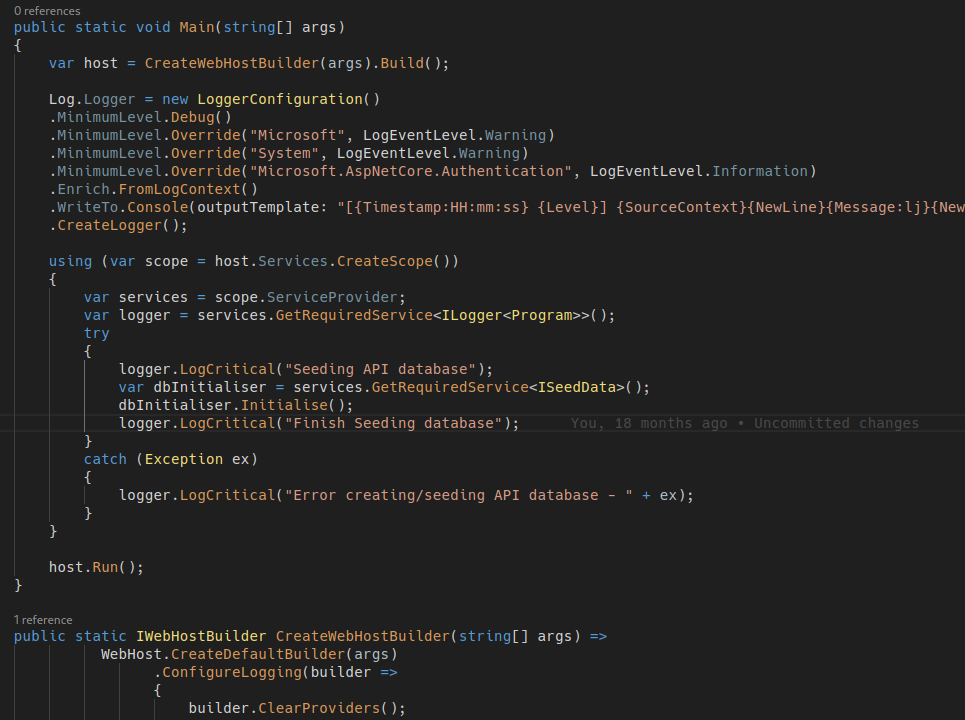
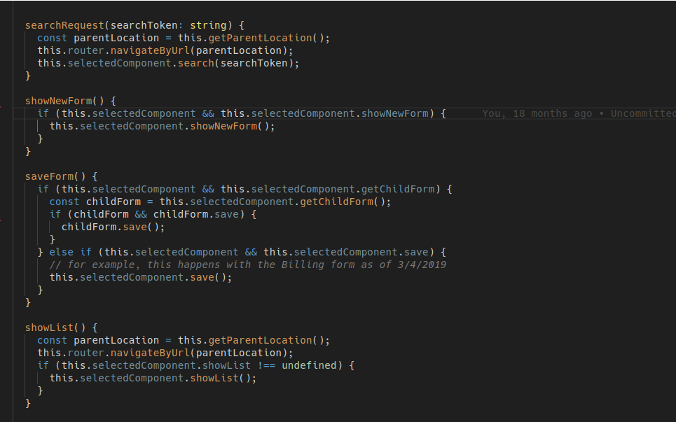
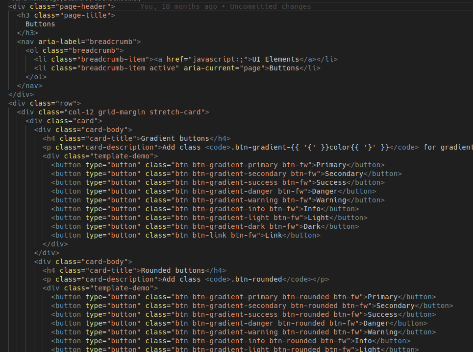
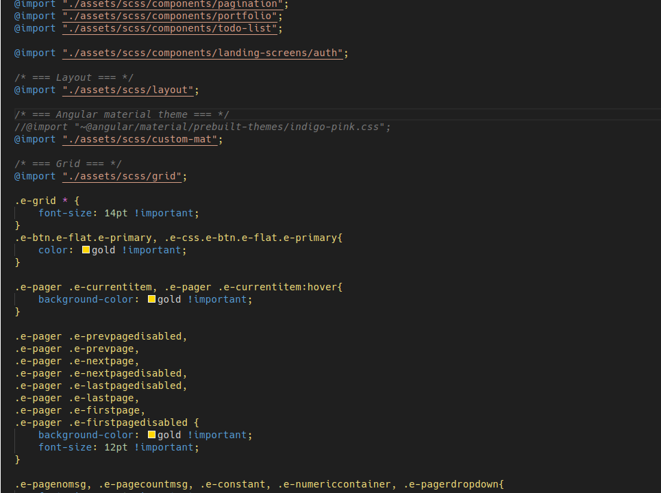
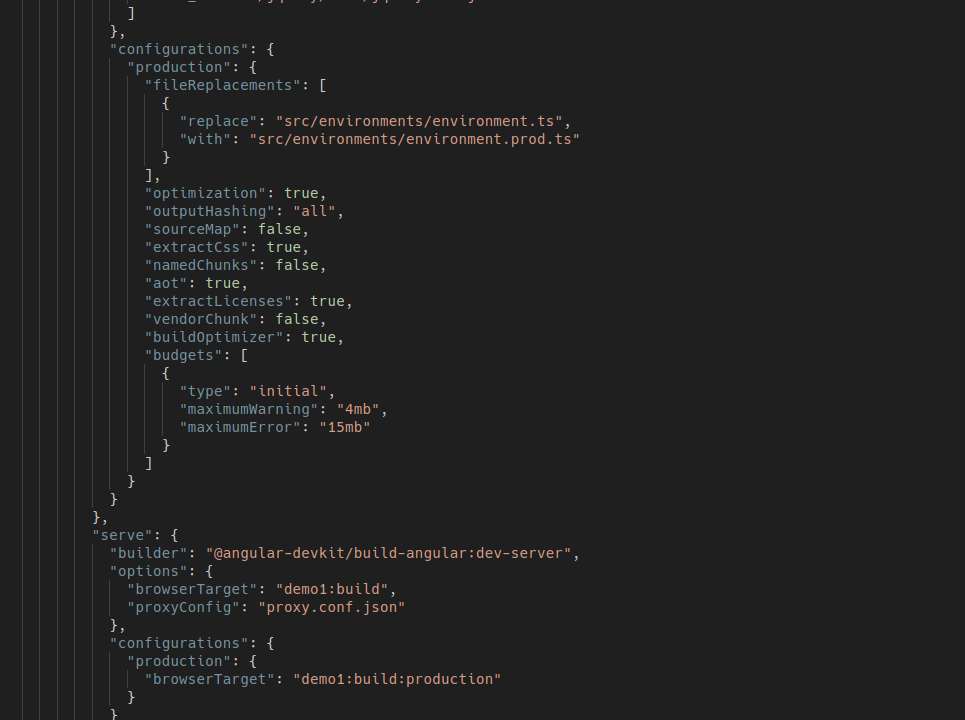

# OXO VSCode Theme

This color theme is a **modified version of VSCode's default dark theme**, designed for optimal eye comfort during long coding sessions. It reduces eye strain by using carefully selected muted colors, minimizing harsh contrasts while maintaining clear syntax highlighting.  

## **Key Features:**  
- **Soft Contrast:** A balanced color palette that avoids extreme brightness differences, reducing glare and fatigue.  
- **Neutral Background:** A deep, non-intrusive dark background that prevents eye strain in low-light environments.  
- **Subdued Accents:** Syntax highlighting remains distinct but uses gentler tones to avoid visual overload.  
- **Optimized Readability:** Clear yet comfortable text colors ensure code remains easy to read for hours.  

Perfect for developers who spend long hours in the editor, this theme prioritizes usability without sacrificing aesthetics. Whether working day or night, it keeps your focus on the code—not on adjusting your eyes.  

*Available for Visual Studio Code — install now and code with less strain!*  

## Screenshots

### C#

### TypeScript

### HTML

### CSS

### JSON
